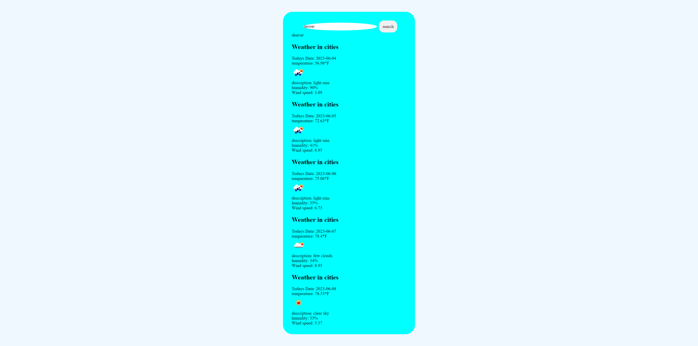

# Weather-Forecast
  
## Description
In challenge five we were asked to create a simple weather app that would show the weather over the next 5 days. All you have to do is type in what city you would like to see the weather of and the api will make a call that will then display the weather of that city.
## Table of Contents
1. [Install](#install)
2. [Usage](#usage)
3. [Contribution](#contribution)
4. [License](#license)

## install
N/A

## usage
Click the link to access the quiz:  https://marvinblunck.github.io/weather-forcast/

Type in the city you would like to see the weather of into the search bar and hit search and then the weather will display. If you would like to see the weather of a different city just type that city in next and search again.

This is the preview of the page:

What the weather looks like in a specific city.

## contribution
I wrote everything with the help of tutor Andrew Hardmon who helped with everything that works on the page.

## license
MIT